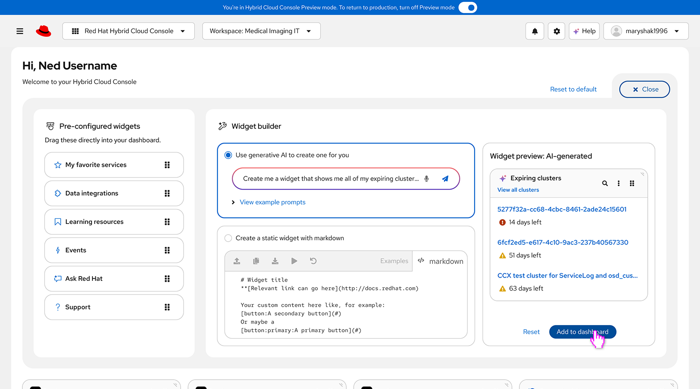

# HCC AI Widget Builder

An internal UX prototype used to explore and demonstrate UI/UX design concepts for AI-powered dashboard and widget-building experiences.

### 🔗 Live Prototype
https://hcc-ai-widget-builder.vercel.app/

### 🎨 Design Preview
**Figma Working Design File:**  
https://www.figma.com/design/c1GHDIdhEGkwVZ0jt65q9q/NextGenUI-Dashboard-Widgets?node-id=0-1&t=KZCfD9CcCWUCEmvo-1

[](https://www.figma.com/design/c1GHDIdhEGkwVZ0jt65q9q/NextGenUI-Dashboard-Widgets?node-id=0-1&t=KZCfD9CcCWUCEmvo-1)

---

## 🎯 Purpose

This application is a working prototype designed for:

- Stakeholder demos  
- UX concept validation  
- Interaction exploration  
- Layout and widget experimentation  
- Rapid iteration on dashboard builder ideas  

This is not a production product — it is a design exploration environment.

---

## 🧱 Tech Stack

- **React 18**
- **TypeScript**
- **PatternFly 6**
- **Webpack 5**
- **Vercel (static deployment)**

---

## 🚀 Deployment

This project auto-deploys to Vercel whenever changes are pushed to the `main` branch.

See:

👉 [`DEPLOYING.md`](./DEPLOYING.md)

for full deployment workflow instructions.

---

## 🛠 Local Development

Install dependencies:

```bash
npm install
```

Run development server:

```bash
npm run start:dev
```

Build production bundle:

```bash
npm run build
```

Preview production build locally:

```bash
npx sirv dist --single --cors --host --port 8080
```

---

## 🧠 Architecture Notes

- Uses content-hashed asset filenames to prevent stale caching.
- SPA routing handled via `vercel.json` rewrites.
- React Router runs at root (`/`) — no GitHub Pages basename.
- Production builds use `hidden-source-map`.

---

## 📁 Project Structure (Simplified)

```
src/
  app/
    AppLayout/
    Homepage/
    routes.tsx
  index.tsx
webpack.common.js
webpack.prod.js
vercel.json
```

---

## ⚠️ Disclaimer

This repository is for internal UX exploration and demo purposes only.

---

## ✨ Maintained By

Mary Shakshober
